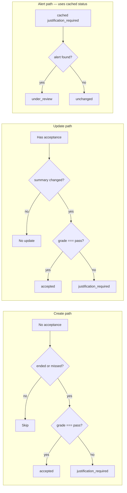

# Rides Acceptor

Background worker in the **controller** module that creates and maintains `ride-acceptances` documents in MongoDB (`operation.ride-acceptances`) based on ride analysis results.

## Purpose and responsibility

### What it does

On a fixed interval, the app:

1. Loads rides from the last **3 days** (by `start_time_scheduled`), in **2-hour chunks**, newest first.
2. For each ride, ensures a matching `RideAcceptance` document exists and reflects the current required analysis results.
3. Optionally auto-fills a justification from a matching **alert** when an acceptance is in `justification_required` status.

It does **not** run ride analyzers, expose HTTP endpoints, or accept/reject rides manually. Those happen upstream (`rides-examiner`) or via the controller API.

### Where it fits

```text
rides-feeder          → creates/updates rides from plans
rides-examiner        → runs analyzers, writes analysis results onto rides
rides-acceptor        → creates/updates ride acceptances from ride analysis  ← this app
rides-locker          → locks ride acceptances after a retention window
controller API        → manual justify, status change, comments, lock/unlock
```

The acceptor is the bridge between **ride analysis grades** (on the ride document) and **operational acceptance state** (in `ride-acceptances`).

### Problem it solves

Operations need a durable acceptance record per ride — whether analysis passed, whether justification is required, and whether an alert or operator provided context. The acceptor automates creation and refresh of those records for recently scheduled rides.

### Input ride vs acceptance outcome

| Term | Meaning in this app |
|---|---|
| **Input ride** | A document from `goDb.operation.rides` with at least `_id`, `operational_status`, `line_id`, `start_time_scheduled`, and `analysis` (map of analyzer results). |
| **Accepted ride** | A `RideAcceptance` with `acceptance_status: 'accepted'`. All required analysis tests have `grade === 'pass'`. |
| **Not accepted (automatic)** | `acceptance_status: 'justification_required'`. At least one required test does not have `grade === 'pass'`. This app never sets `'rejected'`. |
| **Under review** | `acceptance_status: 'under_review'` after alert-based auto-justification. |

> **Terminology note:** The type system defines `'rejected'` as a valid `acceptance_status`, but **this app never writes it**. Manual rejection is handled by the controller API (`changeStatus`).

---

## Ride acceptance rules

Rules are evaluated in `testRide()` (`src/utils.ts`). Only one test is required today:

```ts
REQUIRED_TESTS = ['SIMPLE_THREE_VEHICLE_EVENTS']
```

### Rule 1 — Operational status gate (create only)

| Condition | Result |
|---|---|
| `operational_status` is `'ended'` or `'missed'` | Continue to analysis evaluation |
| Any other status (`'running'`, `'scheduled'`, …) | **No acceptance created**; function returns silently |

**Scope:** Applies only in `createRideAcceptance()`. Updates do **not** re-check operational status.

**Why:** Only finished or missed rides should get an initial acceptance record.

### Rule 2 — Required analysis test: `SIMPLE_THREE_VEHICLE_EVENTS`

| Check | Pass | Fail |
|---|---|---|
| `ride.analysis['SIMPLE_THREE_VEHICLE_EVENTS']?.grade === 'pass'` | Contributes to acceptance | Contributes to `justification_required` |

**What is validated:** The stored grade on the ride's pre-computed analysis entry. The acceptor does **not** re-run the analyzer from `rides-examiner`.

**Missing or absent test key:**

- Pass check: treated as **fail** (`undefined?.grade !== 'pass'`).
- Summary stored: synthetic entry `{ grade: 'fail', message: 'Test was not found for this ride', reason: 'SIMPLE_THREE_VEHICLE_EVENTS' }`.

**Non-`'pass'` grades** (`'fail'`, `'skip'`, `'error'`, or any other value): treated as **fail** for acceptance purposes.

### Rule 3 — Composite acceptance decision

| All required tests `grade === 'pass'` | `acceptance_status` |
|---|---|
| Yes | `'accepted'` |
| No | `'justification_required'` |

There is no partial acceptance. One failing required test is enough for `justification_required`.

### Rule 4 — Alert auto-justification

Runs **after** create/update, only when the **cached** acceptance (loaded at chunk start) has `acceptance_status === 'justification_required'`.

An alert must match **all** of:

| Field | Condition |
|---|---|
| `created_at` | ≥ 2 days ago (Europe/Lisbon) |
| `reference_type` | `'rides'` or `'lines'` |
| `references` | At least one element with `parent_id` in `[ride._id, ride.line_id]` |

If matched → update acceptance to:

- `acceptance_status: 'under_review'`
- `justification` populated from the alert (`cause`, `description`, `created_by`, timestamps)
- `justification_source: 'ALERT'`

If no alert matches → no change.

### Rule evaluation order

```text
1. [create only] operational_status gate
2. testRide() → accepted | justification_required
3. [existing acceptance only, if cached status was justification_required] alert lookup
```

Updates skip step 1 entirely.

### Decision table

| Scenario | Acceptance created? | Final status (this run) |
|---|---|---|
| No acceptance, status `running` | No | — |
| No acceptance, status `ended`, test passes | Yes | `accepted` |
| No acceptance, status `ended`, test fails | Yes | `justification_required` |
| No acceptance, status `ended`, test missing | Yes | `justification_required` |
| Existing acceptance, summary unchanged | — | unchanged (no DB write) |
| Existing acceptance, summary changed, test passes | — | `accepted` |
| Existing acceptance, summary changed, test fails | — | `justification_required` |
| Cached status `justification_required`, matching alert | — | `under_review` |

---

## Processing flow

The app runs `main()` every **10 minutes** via `runOnInterval`. Each run processes timestamp chunks from **now − 3 days** to **now − 30 seconds**, split into **2-hour** intervals (newest first).


### Per-ride branch detail



---

## Examples

Examples reflect `testRide()` logic. Analysis objects are simplified to the fields the acceptor reads.

### Accepted

```json
{
  "_id": "ride-001",
  "operational_status": "ended",
  "line_id": "line-10",
  "analysis": {
    "SIMPLE_THREE_VEHICLE_EVENTS": { "grade": "pass", "reason": "ALL_STOPS_FOUND" }
  }
}
```

→ `acceptance_status: 'accepted'`, `analysis_summary` contains the test entry.

### Not accepted — test failed

```json
{
  "_id": "ride-002",
  "operational_status": "ended",
  "analysis": {
    "SIMPLE_THREE_VEHICLE_EVENTS": { "grade": "fail", "reason": "MISSING_MIDDLE_STOPS" }
  }
}
```

→ `acceptance_status: 'justification_required'`.

### Not accepted — test missing

```json
{
  "_id": "ride-003",
  "operational_status": "missed",
  "analysis": {}
}
```

→ `acceptance_status: 'justification_required'`, summary includes synthetic fail for `SIMPLE_THREE_VEHICLE_EVENTS`.

### No acceptance created — ride still active

```json
{
  "_id": "ride-004",
  "operational_status": "running",
  "analysis": {
    "SIMPLE_THREE_VEHICLE_EVENTS": { "grade": "pass" }
  }
}
```

→ No `RideAcceptance` document created. Will be picked up on a later run once status becomes `ended` or `missed`.

### Alert auto-justification

Precondition: acceptance already exists with `acceptance_status: 'justification_required'` **in the chunk's cached map** (see [Known discrepancies](#known-discrepancies)).

Alert:

```json
{
  "created_at": "<within last 2 days>",
  "reference_type": "rides",
  "references": [{ "parent_id": "ride-002", "child_ids": [] }],
  "cause": "CONSTRUCTION",
  "description": "Detour in effect",
  "created_by": "operator-1"
}
```

→ `acceptance_status: 'under_review'`, `justification.justification_source: 'ALERT'`.

### Edge case — update skipped

If `analysis_summary` serializes identically to the stored summary (`JSON.stringify` comparison), no DB update occurs even if `acceptance_status` on the stored document differs from what `testRide()` would compute.

### Edge case — alert one cycle late

If a ride **newly** fails on this run (update sets `justification_required`), alert justification does **not** run in the same iteration because the cached map still holds the previous status. It runs on the **next** 10-minute cycle if status remains `justification_required`.

---

## Technical details

### Source layout

| File | Responsibility |
|---|---|
| `src/index.ts` | Interval loop, chunking, ride/acceptance fetch, orchestration |
| `src/create-ride-acceptance.ts` | Insert new acceptance (with operational status gate) |
| `src/update-ride-acceptance.ts` | Update acceptance when analysis summary changes |
| `src/alert-justification.ts` | Alert lookup and auto-justification |
| `src/utils.ts` | `testRide()` and `REQUIRED_TESTS` |

There are **no tests** in this package.

### Input / output types

**Input:** `Ride` from `@tmlmobilidade/go-types-operation` — the code reads `operational_status`, `line_id`, `analysis`, and `_id`. The published `Ride` schema in that package does not currently declare `operational_status` or `analysis`; the app assumes an extended ride shape at runtime.

**Output:** `RideAcceptance` documents:

```ts
{
  ride_id: string
  acceptance_status: 'accepted' | 'justification_required' | 'under_review' | 'rejected'
  analysis_summary: Record<string, { grade: GradeStatus; reason: string | null }>
  justification: RideJustification | null
  overrides: { trip_id: string | null }
  comments: []
  is_locked: false          // on create
  created_by: 'system'       // on create
}
```

### Events and messaging

None. The app is a polling worker — no queues, webhooks, or pub/sub.

### External dependencies

| Dependency | Usage |
|---|---|
| `@tmlmobilidade/go-interfaces-godb` | MongoDB: `operation.rides`, `operation.rideAcceptances`, `operation.alerts` |
| `@tmlmobilidade/go-types-operation` | `Ride`, `RideAcceptance` types |
| `@tmlmobilidade/go-utils-dates` | Europe/Lisbon timestamps for chunks and alert window |
| `@tmlmobilidade/go-utils-exec` | `runOnInterval` (10m) |
| `@tmlmobilidade/logger` | Logging + Sentry bootstrap |
| `@tmlmobilidade/timer` | Per-chunk timing |
| `luxon` | `Interval.splitBy({ hour: 2 })` |

### Configuration

All constants are hard-coded — **no environment variables** in this app (Sentry may read env vars via `initSentryNode()`).

| Constant | Value | Location |
|---|---|---|
| Sync window | 3 days | `SYNC_DAYS_BACK` |
| Run interval | 10 minutes | `runOnInterval(..., { intervalMs: '10m' })` |
| Chunk size | 2 hours | `Interval.splitBy({ hour: 2 })` |
| Upper bound offset | 30 seconds before now | avoids very recent rides |
| Alert lookback | 2 days | `alert-justification.ts` |
| Timezone | `Europe/Lisbon` | chunk boundaries and alert filter |

### Side effects

- **Inserts** into `operation.ride-acceptances` for new ended/missed rides.
- **Updates** existing acceptances when `analysis_summary` changes.
- **Updates** to `under_review` + `justification` when a matching alert is found.
- **Logging** at info/error level per operation.
- **Process exit** on unhandled top-level error after 10 seconds (`process.exit(1)`). Per-ride errors are caught and logged without stopping the chunk.

### Error handling

| Layer | Behavior |
|---|---|
| `createRideAcceptance` / `updateRideAcceptance` / `alertJustification` | `try/catch` — log error, continue with next ride |
| `main()` top-level | Log, schedule `process.exit(1)` after 10s; next interval may not run |
| Sentry init failure | Logged; app continues |

### Downstream interactions

- **`rides-locker`** locks acceptances (`is_locked: true`) after a separate retention window.
- **Controller API** (`/ride-acceptance/*`) handles manual justify, status changes, comments, and lock toggles — independent of this worker.

---

## Known discrepancies

These are present in the current implementation. Documented as-is, not as intended design.

1. **`goDb.operation.rides` is not on `OperationDatabase`** — the godb interface exposes `rideAcceptances` and `alerts` but not `rides`. Typecheck fails; runtime depends on a rides collection being available.

2. **`testRide()` checks `.grade` but analyzer types use `.grade_status`** — `RideAnalysisBase` and `rides-examiner` analyzers use `grade_status`. If analysis on the ride only has `grade_status`, every test is treated as fail/missing.

3. **`analysis_summary` shape mismatch** — `testRide()` stores full analysis objects (including `grade_status`, `message`, etc.), while `RideAcceptanceSchema.analysis_summary` expects `{ grade, reason }` per key.

4. **`justification_source: 'ALERT'` vs schema `'alert'`** — `RideJustificationSourceValues` is `['manual', 'alert']` (lowercase). The app writes `'ALERT'`.

5. **Alert path uses stale cached status** — after `updateRideAcceptance()` may set `justification_required`, alert lookup still reads the pre-update status from `acceptanceMap`. New failures get alert justification one cycle later.

6. **`totalRides` global counter always logs 0** — outer `const totalRides = 0` shadows the per-chunk counter; the final log line is wrong.

7. **`RideAnalysisSummary` type import** — referenced in `utils.ts` but not exported from `@tmlmobilidade/go-types-operation`.

8. **No `'rejected'` path** — failed tests produce `justification_required`, not `rejected`. Rejection is only via manual API action.

---

## Running locally

```bash
# from modules/controller/apps/rides-acceptor
pnpm dev    # tsx watch
pnpm start  # node dist/index.js (after build)
```

Requires MongoDB access via godb and ride documents with the fields this app reads.
