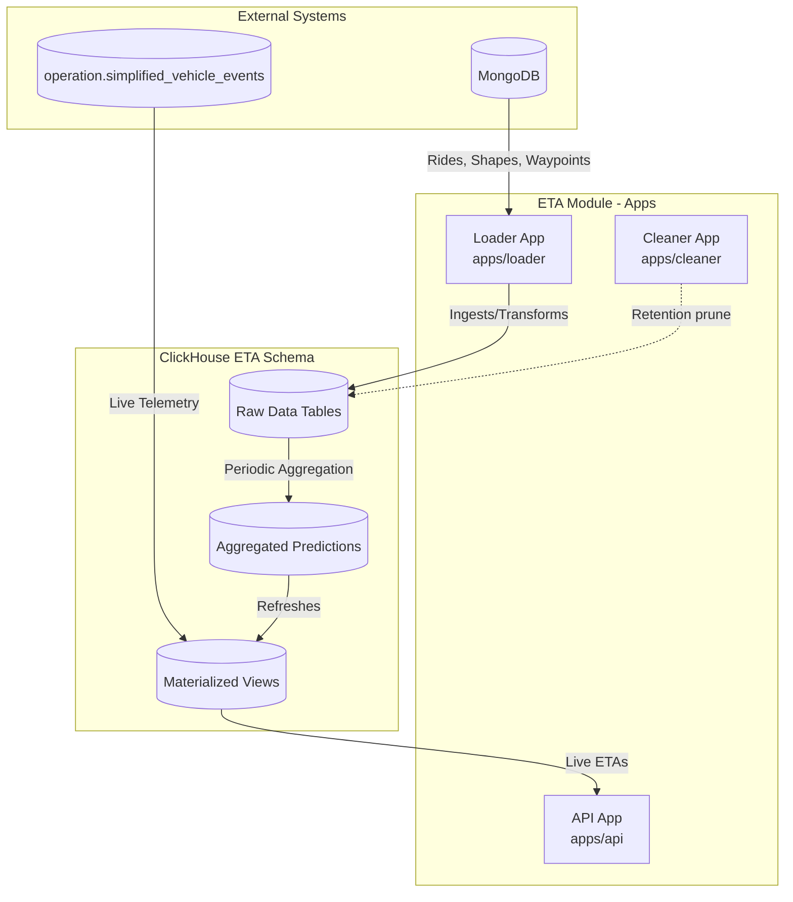

# ETA System Architecture

This document provides a high-level overview of the architecture of the ETA system. The `@modules/eta` module is responsible for computing real-time, highly accurate ETA predictions for transit operations by combining live telemetry (vehicle positions) with historical node-to-node travel times. 

## Architectural Overview

The system is built around a batch-loading and stream-processing architecture powered by **ClickHouse** for heavy aggregation and analytical queries, and **Node.js/TypeScript** services to orchestrate the synchronization, processing, and exposure of data.

## Submodules & Applications

The `@modules/eta` namespace is divided into three standalone services (apps) and a SQL schema repository:

### 1. `apps/loader` (Ingestion & Processing Pipeline)
- **Responsibility:** Acts as the main pipeline orchestrator. It runs on an interval to pull current and historical operational data (rides, shapes, waypoints) from MongoDB into ClickHouse. It also executes heavy transformation SQL queries to build historical node-to-node travel times and snapped waypoints.
- **Key Path:** `modules/eta/apps/loader/src/index.ts`

### 2. `apps/cleaner` (Data Retention)
- **Responsibility:** Maintains system health by pruning old data. Since the ETA system relies on a sliding window of recent telemetry (e.g., current day's active rides) and a set window of history (e.g., 30 days of node travel times), the cleaner periodically deletes out-of-window or orphaned records.
- **Key Path:** `modules/eta/apps/cleaner/src/index.ts`

### 3. `apps/api` (Prediction Interface)
- **Responsibility:** Exposes the pre-computed real-time ETAs to clients via HTTP endpoints. Instead of running heavy aggregations per request, it acts as a thin layer querying ClickHouse materialized views (`pred_trip_stop_etas`), ensuring ultra-low latency response times.
- **Key Path:** `modules/eta/apps/api/src/endpoints/eta/eta.controller.ts`

### 4. `sql` (ClickHouse Schema & Queries)
- **Responsibility:** Defines the tables, materialized views (MVs), transformation queries, and cleanup scripts. ClickHouse handles the heavy lifting of the spatial algorithms (snapping GPS to geometry nodes) and complex aggregations (historical weighted travel times).
- **Key Structure:** 
  - `sql/api`: Queries used by the API to fetch ETAs.
  - `sql/bootstrap`: DDL scripts for tables and MVs.
  - `sql/loader`: Transformation scripts triggered by the Loader.
  - `sql/cleanup`: Retention pruning scripts triggered by the Cleaner.

## Execution Pipeline

The execution of the ETA system fundamentally operates on a continuous, multi-layered loop:

1. **Bootstrap/DDL:** The Loader ensures tables and Materialized Views are instantiated (`0a-create-tables.sql` and `mv-*.sql`).
2. **Current Window Sync:** The Loader fetches current operational rides and waypoints from MongoDB and ingests them into `eta.curr_rides` and `eta.curr_waypoints`.
3. **Historical Sync:** The Loader batches historical rides and vehicle events into `eta.hist_rides` and `eta.hist_vehicle_events`.
4. **Shape Nodes Precomputation:** Complex transit shapes are chopped into discrete nodes (e.g., every 25 meters) and geohashed (`sync-shape-nodes.ts`).
5. **Historical Transformation:** Raw historical GPS points are spatially snapped to shape nodes and travel times are computed per node (`2-build_hist_node_travel_times.sql`).
6. **Aggregation:** Travel times are bucketed by time of day, weekday/weekend, and seasonal periods (`3-aggregate_hist_node_travel_times.sql`).
7. **Live Prediction Generation:** The Materialized Views continuously cross-reference the aggregated node times with *live* vehicle events to predict the exact ETA for upcoming stops (`mv-predict-trip-stop-etas.sql`).
8. **Garbage Collection:** The Cleaner runs concurrently to remove data falling outside the defined operational time windows.

---
_For a deeper dive into how data moves through these phases, see [Data Flow & Processing Pipeline](02-data-flow-and-pipeline.md)._