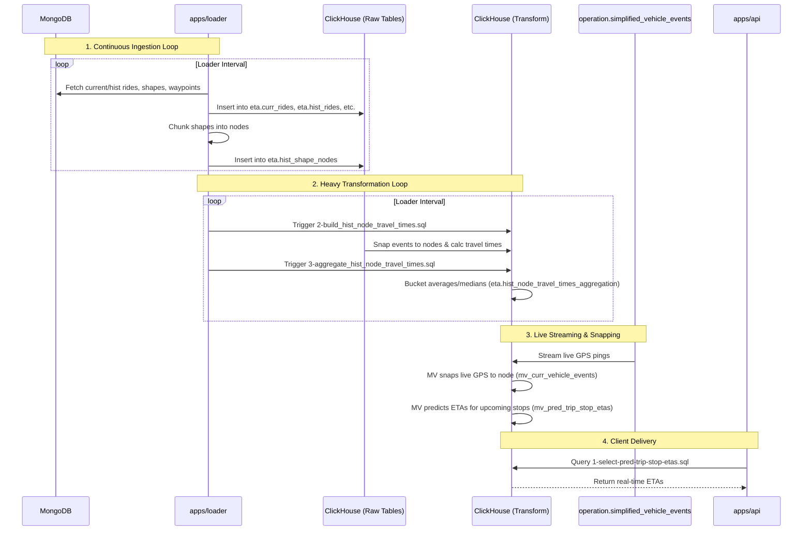

# Data Flow & Processing Pipeline

This document explains the flow of data within the ETA system, detailing how external sources are ingested, transformed, and eventually served as predictions.

## Pipeline Diagram

## Step-by-Step Data Movement

### 1. Ingestion (`apps/loader`)
The `loader` runs continuously via an interval loop (`apps/loader/src/index.ts`). It pulls from several external collections:
- **Rides & Shapes:** Queries MongoDB for current scheduled window rides and historical window rides (`apps/loader/src/process/rides-query.ts`).
- **Vehicle Events:** Historical vehicle telemetry is pushed to `eta.hist_vehicle_events`.
- **Shape Nodes Generation:** For distinct transit routes, the path (geometry) is chunked into node segments based on distance (`AppConfig.shapeNodeChunkLength`, usually 25m). These are ingested into `eta.hist_shape_nodes` with spatial index support (geohash).
- **Waypoints:** The stops for the current trips are ingested into `eta.curr_waypoints`.

### 2. Transformation & Aggregation Pipeline
Once the base data is loaded, the pipeline triggers SQL macros to perform the heavy transformation:
- **Snap Waypoints:** Waypoint locations are matched to the closest previously-generated shape node. Results are written to `eta.curr_waypoints_snapped` (`sql/loader/4-snap-waypoints.sql`).
- **Build Historical Travel Times:** The system runs `sql/loader/2-build_hist_node_travel_times.sql` in date chunks. It spatially snaps millions of historical GPS events to the route shape nodes and computes the time it took to travel between them.
- **Aggregate Travel Times:** `sql/loader/3-aggregate_hist_node_travel_times.sql` rolls up raw travel times into statistical distributions (min, max, avg, median) partitioned by:
  - Shape and node index.
  - Season/Calendar Period (e.g., Summer, School, Christmas).
  - Time of day (Peak AM, Peak PM, Mid, Off Peak).
  - Day type (Weekday, Weekend).

### 3. Materialized Views (Live Streaming)
The true power of the ETA engine lies in ClickHouse's Materialized Views. They continuously react to the underlying state:
- **`eta.mv_curr_vehicle_events`:** As raw live vehicle telemetry enters the database (e.g., from Kafka into `operation.simplified_vehicle_events`), this MV joins it with the scheduled rides (`eta.curr_rides`) to map the vehicle to its shape. It immediately snaps the live GPS point to the closest route node using `argMin` and `greatCircleDistance`.
- **`eta.mv_pred_node_etas`:** Refreshed every 3 minutes. It collapses the historical statistics into a single predicted travel time per node by applying weighted rolling averages (e.g., giving higher weight to the last 3 days vs the last 30 days).
- **`eta.mv_pred_trip_stop_etas`:** Refreshed every 30 seconds. It determines the vehicle's *current* node on the route, looks ahead to the upcoming *stop* nodes, and sums up the predicted travel times between the current node and the target stops to produce a real-time `eta_seconds`.

### 4. Cleanup & Retention (`apps/cleaner`)
Unmanaged timeseries and spatial data will degrade performance. The `cleaner` app triggers deletion tasks on an interval:
- **`1-delete-out-of-window-curr-rides.sql`**: Prunes rides outside of the active schedule sliding window.
- **`2-delete-out-of-window-curr-vehicle-events.sql`**: Removes live pings that fall outside the retention window or belong to orphaned rides.
- **`3-delete-orphan-curr-waypoints.sql`**: Removes waypoints for rides that have been dropped.

### 5. API Delivery (`apps/api`)
The API is deliberately kept "dumb" regarding logic. The controllers in `apps/api/src/endpoints/eta/eta.controller.ts` simply pass through queries referencing `api/1-select-pred-trip-stop-etas.sql` and `api/2-select-pred-trip-stop-etas-by-trip-id.sql`. Because all computations and aggregations are handled asynchronously via Materialized Views, API responses are essentially an indexed `SELECT` query, ensuring extreme throughput and low latency.