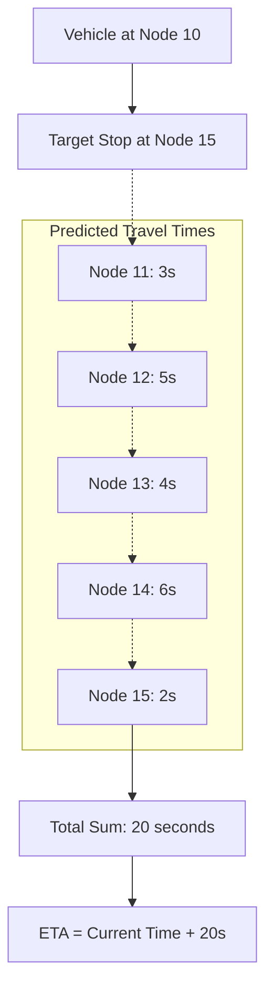

# ETA Calculation & Algorithms

The ETA engine uses a segment-based historical modeling approach. By breaking complex geographic routes into tiny sequential chunks ("nodes"), the system can calculate travel times independent of the overall route's length, allowing it to adapt dynamically as vehicles progress.

This document breaks down the algorithms responsible for generating those predictions.

## 1. Node Generation & Spatial Preprocessing
Before any travel time is calculated, a route's spatial path (shape) must be discretized.
*   **Logic:** The system utilizes `chunkLineByDistanceV2` (`sync-shape-nodes.ts`) to split a continuous GeoJSON linestring into coordinates exactly $N$ meters apart (e.g., 25m). 
*   **Optimization:** Each node is assigned a geohash (precision 7). This acts as a spatial bloom filter inside ClickHouse, dramatically pruning the fan-out during spatial joins.

## 2. Snapping & Historical Travel Time Calculation
Located in `sql/loader/2-build_hist_node_travel_times.sql`.

### Phase A: Spatial Join (Snapping)
For every raw GPS ping, we must determine which shape node the vehicle was passing.
*   **Algorithm:** The event's coordinates are expanded into ~4 adjacent Geohash cells bounding boxes. ClickHouse performs a compound equality hash-join on `(hashed_shape_id, geohash)` against the shape nodes.
*   **Refinement:** From the resulting candidates, an `argMin` over `greatCircleDistance` is calculated to find the absolute nearest node, enforcing a `max_dist_m` cutoff (e.g., 30m) to reject wild GPS drift.

### Phase B: Monotonic Filtering
GPS drift can cause a vehicle's snapped node index to bounce backwards (e.g., Node 10 -> Node 9 -> Node 11).
*   **Algorithm:** A forward-only filter uses a running max window (`max(node_idx) OVER (...)`) to discard any event where the node index is lower than the historically maximum index achieved by that specific ride.

### Phase C: Segment Validation
We must ensure the segment between two valid events represents genuine movement.
*   **Rules:** The gap between the previous ping and current ping must represent a sensible speed (between 1 and 120 km/h). 
*   **Bearing Validation:** The GPS trajectory heading (`atan2`) is compared against the actual geometry heading of the shape segment. If the vehicle's heading diverges sharply from the shape (e.g., threshold > 90°), the segment is discarded (handles cases where a route overlaps itself or U-turns).

### Phase D: Expansion & Retiming
Since GPS events don't arrive exactly on every 25m node, an event gap (e.g., Node 10 to Node 15 over 30 seconds) must be interpolated.
*   **Algorithm:** The system divides the elapsed time evenly across the missing nodes in the gap. The true travel time for a specific node is then calculated as the gap to the next *emitted* node timestamp (`lead(created_at)`).

## 3. Statistical Aggregation
Located in `sql/loader/3-aggregate_hist_node_travel_times.sql`.
Raw travel times vary wildly due to traffic, weather, and time of day.
*   **Classification:** Every event is mapped into a specific statistical bucket:
    *   *Operational Date:* Shifted backwards for late-night rides (e.g., a 01:30 AM trip is logically classified under the previous day).
    *   *Calendar Period:* Specific hardcoded date ranges identifying 'School', 'Summer', or 'Christmas' periods, as traffic behaviors change drastically between them.
    *   *Time of Day:* 'Peak AM', 'Mid', 'Peak PM', 'Off Peak'.
    *   *Day Type:* 'Weekday' or 'Weekend'.
*   **Rollup:** The system stores the minimum, maximum, average, and *median* travel times for that node under those specific conditions.

## 4. Weighted Predictions
Located in `sql/bootstrap/mv-predict-node-etas.sql`.
How do we convert buckets of historical medians into a single expected travel time?
*   **Algorithm:** A weighted rolling-window sum is calculated.
*   **Time Horizons:** It averages the past 3, 7, 14, and 30 days of data.
*   **Context Matches:** It also calculates averages specifically for the same weekday, the same day type, and the same time period.
*   **Weights:** These sub-averages are multiplied by constant weights (e.g., `w_last_3d` = 1.0, `w_last_30d` = 0.50, `w_same_period` = 0.70). The final `predicted_travel_time_seconds` is the sum of the weighted values divided by the sum of the weights used.

## 5. Live ETA Generation
Located in `sql/bootstrap/mv-predict-trip-stop-etas.sql`.
*   **Live Snapping:** Just like the historical calculation, live GPS data streaming in is snapped to the current trip's shape. The system tracks the `current_node_index`.
*   **Path Remainder:** The system fetches all upcoming scheduled stops for that trip (`eta.curr_waypoints_snapped`), which are also mapped to specific node indexes.
*   **Summation:** The ETA for an upcoming stop is computed simply by summing the pre-calculated `predicted_travel_time_seconds` for all nodes strictly between the vehicle's `current_node_index` and the target `stop_node_index`.
*   **Output:** The sum is added to the current timestamp to generate a definitive `eta_at` DateTime.

