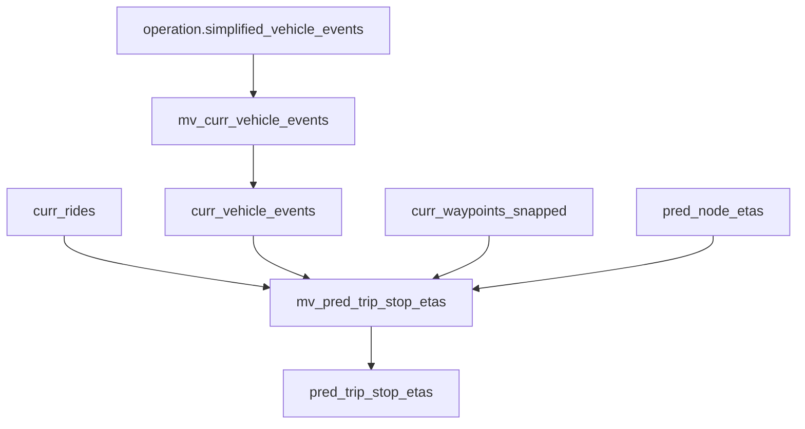
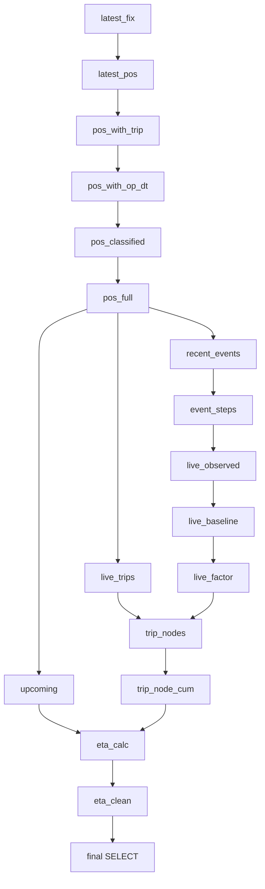
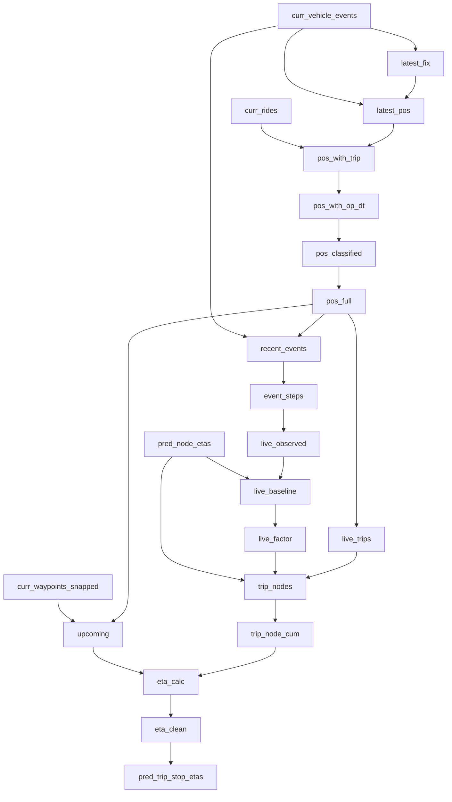
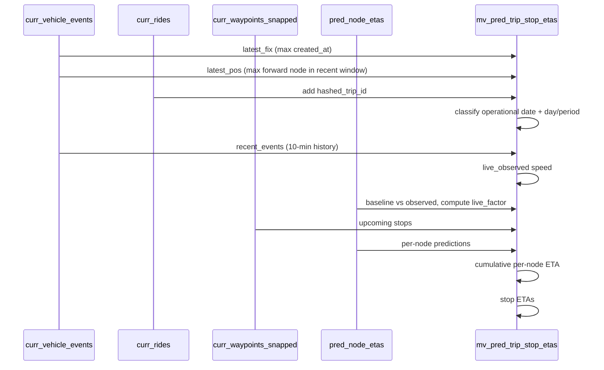

# mv-predict-trip-stop-etas.sql — Technical Specification

## Table of Contents
- [Query Anatomy](#query-anatomy)
- [1. Executive Summary](#1-executive-summary)
- [2. Architectural Overview](#2-architectural-overview)
- [3. Mermaid Diagrams](#3-mermaid-diagrams)
  - [Data Flow Diagram](#data-flow-diagram)
  - [Query Execution Flow](#query-execution-flow)
  - [Dependency Graph](#dependency-graph)
  - [Transformation Pipeline](#transformation-pipeline)
- [4. Full Query Walkthrough](#4-full-query-walkthrough)
- [5. CTE Analysis](#5-cte-analysis)
- [6. Join Analysis](#6-join-analysis)
- [7. Column Lineage](#7-column-lineage)
- [8. Aggregation Analysis](#8-aggregation-analysis)
- [9. Materialized View Semantics](#9-materialized-view-semantics)
- [10. Performance Review](#10-performance-review)
- [11. ETA Prediction Logic](#11-eta-prediction-logic)
- [12. End-to-End Example](#12-end-to-end-example)
- [13. Key Takeaways](#13-key-takeaways)

---

# Query Anatomy

> Inventory of everything referenced or computed, used as the foundation for the rest of this document.

## Tables Referenced
- `{database}.curr_vehicle_events`
- `{database}.curr_rides`
- `{database}.curr_waypoints_snapped`
- `{database}.pred_node_etas`

## Views Referenced
- `mv_pred_trip_stop_etas` (this MV)
- `pred_trip_stop_etas` (target table)
- `pred_node_etas` (target table of another MV)

## CTEs (in order)
1. `latest_fix`
2. `latest_pos`
3. `pos_with_trip`
4. `pos_with_op_dt`
5. `pos_classified`
6. `pos_full`
7. `recent_events`
8. `event_steps`
9. `live_observed`
10. `live_baseline`
11. `live_factor`
12. `upcoming`
13. `live_trips`
14. `trip_nodes`
15. `trip_node_cum`
16. `eta_calc`
17. `eta_clean`

## Joins
- `latest_pos` <- `latest_fix` INNER JOIN `curr_vehicle_events`
- `pos_with_trip` INNER JOIN `curr_rides`
- `recent_events` INNER JOIN `curr_vehicle_events`
- `live_baseline` LEFT JOIN `pred_node_etas`
- `upcoming` INNER JOIN `curr_waypoints_snapped`
- `trip_nodes` INNER JOIN `pred_node_etas`
- `trip_nodes` LEFT JOIN `live_factor`
- `eta_calc` ASOF LEFT JOIN `trip_node_cum`

## Aggregations
- `latest_fix`: `argMax`, `max`
- `latest_pos`: `max`
- `live_observed`: `countIf`, `sumIf`, `minIf`, `maxIf`
- `live_baseline`: `sum`
- `live_factor`: scalar math (no group)
- `live_trips`: `SELECT DISTINCT`
- `trip_node_cum`: window `sum`, `countIf`
- Final SELECT: no aggregate

## Window Functions
- `lagInFrame` for node progression in `event_steps`
- `sum(...) OVER` cumulative in `trip_node_cum`
- `countIf(...) OVER` cumulative in `trip_node_cum`

## MV Outputs (final projection)
- `trip_id`
- `vehicle_id`
- `hashed_trip_id`
- `hashed_shape_id`
- `current_node_index`
- `position_created_at`
- `stop_sequence`
- `stop_id`
- `stop_name`
- `stop_node_index`
- `eta_seconds`
- `eta_at`
- `refreshed_at`

---

# 1. Executive Summary

This materialized view computes live ETAs for upcoming stops by combining real-time vehicle positions with historical per-node travel-time predictions.

Business problem: Riders and operations need accurate, near-real-time arrival predictions for each stop on active trips. Raw GPS events are noisy; historical travel-time distributions need to be adjusted by recent observed vehicle speed.

Inputs:
- Live, snapped vehicle events (`curr_vehicle_events`)
- Current trip metadata (`curr_rides`)
- Upcoming stop node positions (`curr_waypoints_snapped`)
- Historical prediction per node (`pred_node_etas`)

Outputs:
`pred_trip_stop_etas` table rows: per trip/vehicle/stop with ETA seconds and ETA timestamp.

Expected refresh behavior:
`REFRESH EVERY 30 SECOND` — a periodic full recomputation over current data slices.

---

# 2. Architectural Overview

This MV sits in the live ETA pipeline:

1. Ingest live GPS into `operation.simplified_vehicle_events`.
2. Snap live GPS into `curr_vehicle_events` via `mv_curr_vehicle_events`.
3. Predict per-node travel times into `pred_node_etas` via `mv_pred_node_etas` (refresh every 3 minutes).
4. This MV derives per-stop ETAs for each active trip.

Downstream consumers typically include API endpoints that read `pred_trip_stop_etas` to serve rider-facing applications.

Data flow:
- `curr_vehicle_events` -> latest fix + live adjustment
- `pred_node_etas` -> per-node baseline durations
- `curr_waypoints_snapped` -> map stops to node indices
- Join all to produce a per-stop ETA and timestamp

---

# 3. Mermaid Diagrams

## Data Flow Diagram


## Query Execution Flow


## Dependency Graph


## Transformation Pipeline


---

# 4. Full Query Walkthrough

## Table + MV Definition

### Purpose
Creates the output storage and the materialized view that refreshes it.

### SQL Fragment
```sql
CREATE TABLE IF NOT EXISTS {database}.pred_trip_stop_etas (...)
ENGINE = ReplacingMergeTree(refreshed_at)
ORDER BY (trip_id, vehicle_id, stop_sequence);

CREATE MATERIALIZED VIEW IF NOT EXISTS {database}.mv_pred_trip_stop_etas
REFRESH EVERY 30 SECOND
TO {database}.pred_trip_stop_etas
AS
WITH ...
SELECT ...
```

### Detailed Explanation
- `pred_trip_stop_etas` holds the latest per-stop ETAs.
- `ReplacingMergeTree(refreshed_at)` allows newer refreshes to overwrite older rows.
- MV is periodic refresh (not streaming per row).

### Performance Notes
- Refresh cadence (30s) must be lower than execution time to avoid staleness/overlap.
- ReplacingMergeTree merges are async; reads may include duplicate versions until merges.

---

## latest_fix

### Purpose
Identify the latest GPS fix per trip/vehicle.

### SQL Fragment
```sql
latest_fix AS (
  SELECT trip_id, vehicle_id,
         argMax(hashed_shape_id, created_at) AS hashed_shape_id,
         max(created_at) AS position_created_at
  FROM curr_vehicle_events
  WHERE created_at >= now - 30 min
  GROUP BY trip_id, vehicle_id
)
```

### Detailed Explanation
- Restricts to last 30 minutes.
- `argMax` picks the shape in use at the latest timestamp.
- `position_created_at` anchors current time for that vehicle.

### Performance Notes
- Grouping by `(trip_id, vehicle_id)` is modest if the number of active vehicles is small.

---

## latest_pos

### Purpose
Derive `current_node_index` using the furthest-forward node within the last 2 minutes, to avoid backward snapping.

### SQL Fragment
```sql
latest_pos AS (
  SELECT lf.trip_id, lf.vehicle_id, lf.hashed_shape_id,
         max(e.node_index) AS current_node_index,
         lf.position_created_at
  FROM latest_fix lf
  JOIN curr_vehicle_events e
    ON e.trip_id = lf.trip_id AND e.vehicle_id = lf.vehicle_id
  WHERE e.created_at BETWEEN lf.position_created_at - 2 min AND lf.position_created_at
  GROUP BY lf.trip_id, lf.vehicle_id, lf.hashed_shape_id, lf.position_created_at
)
```

### Detailed Explanation
- Uses latest fix time as reference.
- Max node_index in recent window prevents a noisy latest snap from moving backward.

### Performance Notes
- Bounded 2-minute window reduces scan cost.

---

## pos_with_trip -> pos_full

### Purpose
Attach trip identifiers and classify the event into operational time buckets.

### SQL Fragment
```sql
pos_with_trip ... JOIN curr_rides
pos_with_op_dt ... compute operational_dt
pos_classified ... compute operational_date, dow, period_of_day
pos_full ... compute weekday, day_type, school/holiday period
```

### Detailed Explanation
Adds calendar context needed to select correct prediction row in `pred_node_etas`.

### Performance Notes
- Pure CPU-bound transformations; minimal cost.

---

## recent_events -> live_observed -> live_factor

### Purpose
Compute a live adjustment factor from the last 10 minutes of movement.

### SQL Fragment
```sql
recent_events: join curr_vehicle_events in the last 10 min
event_steps: lag(node_index, created_at)
live_observed: countIf/sumIf movement samples
live_baseline: sum predicted baseline between start/end nodes
live_factor: ratio observed/baseline, damped and bounded
```

### Detailed Explanation
- `live_observed` extracts movement deltas.
- `live_baseline` compares to historical per-node predictions.
- `live_factor` adjusts predictions toward observed speed but avoids unstable spikes.

### Performance Notes
- Window `lagInFrame` on recent events only.
- Baseline join is bounded between observed start/end nodes.

---

## upcoming

### Purpose
List all upcoming stops for each active trip/vehicle.

### SQL Fragment
```sql
upcoming AS (
  SELECT ... FROM pos_full
  JOIN curr_waypoints_snapped
  WHERE w.node_index >= current_node_index
    AND period != 'Unknown'
)
```

### Detailed Explanation
Stops already behind the vehicle are excluded.

---

## live_trips -> trip_nodes -> trip_node_cum

### Purpose
Compute cumulative per-node travel time for each vehicle once.

### SQL Fragment
```sql
trip_nodes AS (
  SELECT lt.trip_id, lt.vehicle_id, p.node_index,
         p.predicted_travel_time_seconds * live_adjustment AS node_seconds
  FROM live_trips lt
  JOIN pred_node_etas p
    ON keys match + p.node_index > lt.current_node_index
)
trip_node_cum AS (
  SELECT trip_id, vehicle_id, node_index,
         sum(coalesce(node_seconds,0)) OVER (ORDER BY node_index) AS cum_seconds,
         countIf(node_seconds IS NOT NULL) OVER (...) AS cum_known_nodes
  FROM trip_nodes
)
```

### Detailed Explanation
- Avoids expensive per-stop joins.
- Running sum gives time from current node to any later node.

### Performance Notes
- Key optimization: only scan nodes once per trip/vehicle (O(nodes), not O(stops x nodes)).

---

## eta_calc -> eta_clean -> final SELECT

### Purpose
Map cumulative time to each stop and emit ETAs.

### SQL Fragment
```sql
eta_calc AS (
  SELECT ...,
         if(c.cum_known_nodes > 0, c.cum_seconds, 0) AS eta_seconds
  FROM upcoming u
  ASOF LEFT JOIN trip_node_cum c
    ON c.trip_id = u.trip_id
   AND c.vehicle_id = u.vehicle_id
   AND c.node_index <= u.stop_node_index
)

eta_clean AS (...) -- removes NaN/Inf
SELECT ..., eta_at = position_created_at + eta_seconds
```

### Detailed Explanation
- ASOF picks the last node <= stop node, ensuring coverage when stop nodes are not present in `pred_node_etas`.
- `eta_at` is computed from position timestamp + ETA.

---

# 5. CTE Analysis

| Attribute | Description |
|---|---|
| Name | `latest_fix` |
| Purpose | Latest fix per trip/vehicle |
| Inputs | curr_vehicle_events |
| Outputs | trip_id, vehicle_id, hashed_shape_id, position_created_at |
| Dependencies | none |
| Complexity | Low |

| Attribute | Description |
|---|---|
| Name | `latest_pos` |
| Purpose | Current node from forward max |
| Inputs | latest_fix, curr_vehicle_events |
| Outputs | current_node_index |
| Dependencies | latest_fix |
| Complexity | Medium |

| Attribute | Description |
|---|---|
| Name | `pos_with_trip` |
| Purpose | Add hashed_trip_id |
| Inputs | latest_pos, curr_rides |
| Outputs | hashed_trip_id |
| Dependencies | latest_pos |
| Complexity | Low |

| Attribute | Description |
|---|---|
| Name | `pos_with_op_dt` |
| Purpose | Operational date alignment |
| Inputs | pos_with_trip |
| Outputs | operational_dt |
| Dependencies | pos_with_trip |
| Complexity | Low |

| Attribute | Description |
|---|---|
| Name | `pos_classified` |
| Purpose | Period-of-day + DOW |
| Inputs | pos_with_op_dt |
| Outputs | operational_date, dow, period_of_day |
| Dependencies | pos_with_op_dt |
| Complexity | Low |

| Attribute | Description |
|---|---|
| Name | `pos_full` |
| Purpose | Calendar classification |
| Inputs | pos_classified |
| Outputs | weekday, day_type, period |
| Dependencies | pos_classified |
| Complexity | Medium |

| Attribute | Description |
|---|---|
| Name | `recent_events` |
| Purpose | Last 10 min events |
| Inputs | pos_full, curr_vehicle_events |
| Outputs | node_index, created_at |
| Dependencies | pos_full |
| Complexity | Medium |

| Attribute | Description |
|---|---|
| Name | `event_steps` |
| Purpose | Step deltas |
| Inputs | recent_events |
| Outputs | prev_node_index, prev_created_at |
| Dependencies | recent_events |
| Complexity | Medium |

| Attribute | Description |
|---|---|
| Name | `live_observed` |
| Purpose | Observed movement stats |
| Inputs | event_steps |
| Outputs | move_samples, observed_seconds, start/end node |
| Dependencies | event_steps |
| Complexity | Medium |

| Attribute | Description |
|---|---|
| Name | `live_baseline` |
| Purpose | Baseline predicted time |
| Inputs | live_observed, pred_node_etas |
| Outputs | baseline_seconds |
| Dependencies | live_observed |
| Complexity | Medium |

| Attribute | Description |
|---|---|
| Name | `live_factor` |
| Purpose | Adjustment multiplier |
| Inputs | live_baseline |
| Outputs | live_adjustment |
| Dependencies | live_baseline |
| Complexity | Low |

| Attribute | Description |
|---|---|
| Name | `upcoming` |
| Purpose | Upcoming stops |
| Inputs | pos_full, curr_waypoints_snapped |
| Outputs | stop columns |
| Dependencies | pos_full |
| Complexity | Medium |

| Attribute | Description |
|---|---|
| Name | `live_trips` |
| Purpose | Unique active trips |
| Inputs | pos_full |
| Outputs | trip/calendar key |
| Dependencies | pos_full |
| Complexity | Low |

| Attribute | Description |
|---|---|
| Name | `trip_nodes` |
| Purpose | Nodes ahead of vehicle |
| Inputs | live_trips, pred_node_etas, live_factor |
| Outputs | node_seconds |
| Dependencies | live_trips, live_factor |
| Complexity | High |

| Attribute | Description |
|---|---|
| Name | `trip_node_cum` |
| Purpose | Cumulative node time |
| Inputs | trip_nodes |
| Outputs | cum_seconds |
| Dependencies | trip_nodes |
| Complexity | Medium |

| Attribute | Description |
|---|---|
| Name | `eta_calc` |
| Purpose | Stop ETA mapping |
| Inputs | upcoming, trip_node_cum |
| Outputs | eta_seconds |
| Dependencies | upcoming |
| Complexity | Medium |

| Attribute | Description |
|---|---|
| Name | `eta_clean` |
| Purpose | Remove NaN/Inf |
| Inputs | eta_calc |
| Outputs | eta_seconds |
| Dependencies | eta_calc |
| Complexity | Low |

---

# 6. Join Analysis

| Left Side | Right Side | Join Type | Condition | Reason |
|---|---|---|---|---|
| latest_fix | curr_vehicle_events | INNER | trip_id, vehicle_id + time window | get recent nodes near latest fix |
| latest_pos | curr_rides | INNER | trip_id | add hashed_trip_id |
| pos_full | curr_vehicle_events | INNER | trip_id, vehicle_id + 10-min window | build recent movement samples |
| live_observed | pred_node_etas | LEFT | shape+calendar + node range | compare observed vs baseline |
| pos_full | curr_waypoints_snapped | INNER | hashed_trip_id | list upcoming stops |
| live_trips | pred_node_etas | INNER | shape+calendar + node_index > current | node scan per vehicle |
| trip_nodes | live_factor | LEFT | trip_id, vehicle_id | apply live adjustment |
| upcoming | trip_node_cum | ASOF LEFT | trip_id, vehicle_id, node_index <= stop | cumulative ETA lookup |

---

# 7. Column Lineage

| Final Column | Origin Table | Transformation |
|---|---|---|
| trip_id | curr_vehicle_events | carried through CTEs |
| vehicle_id | curr_vehicle_events | carried through CTEs |
| hashed_trip_id | curr_rides | join via trip_id |
| hashed_shape_id | curr_vehicle_events | argMax by created_at |
| current_node_index | curr_vehicle_events | max node in recent window |
| position_created_at | curr_vehicle_events | max created_at |
| stop_sequence | curr_waypoints_snapped | direct |
| stop_id | curr_waypoints_snapped | direct |
| stop_name | curr_waypoints_snapped | direct |
| stop_node_index | curr_waypoints_snapped | direct |
| eta_seconds | pred_node_etas + live_factor | cumulative sum + ASOF lookup |
| eta_at | position_created_at | add eta_seconds |
| refreshed_at | now() | computed |

---

# 8. Aggregation Analysis

- `latest_fix`: group by trip/vehicle to pick latest created_at and shape
- `latest_pos`: group by trip/vehicle/shape to pick max node in recent window
- `live_observed`: aggregates movement samples in 10-min window
- `live_baseline`: sums predicted node travel time between observed min/max nodes
- `trip_node_cum`: window cumulative sum over node_index per trip/vehicle

---

# 9. Materialized View Semantics

- Refresh: every 30 seconds.
- Mode: full refresh of the view query result.
- Consistency: eventual. `ReplacingMergeTree` merges in background.
- Freshness: bounded by MV runtime plus schedule.
- Failure scenarios: if query runtime exceeds refresh interval, refreshes overlap and stale data persists.

---

# 10. Performance Review

Primary cost drivers:
- Scanning `pred_node_etas` by shape/calendar.
- Window functions over node ranges.

Optimizations in the current query:
- Node scan is per vehicle, not per stop.
- `node_index > current_node_index` leverages ORDER BY prefix.

Potential optimizations:
- Add projection on `pred_node_etas` to accelerate range scans.
- Consider `FINAL` if duplicate rows are present (tradeoff: higher CPU).
- Precompute cumulative node times in a separate MV per shape/calendar.

---

# 11. ETA Prediction Logic

1. Find latest fix and current node.
2. Determine time-of-day and service period.
3. Compute a live adjustment ratio based on recent movement.
4. Use predicted per-node travel times plus live adjustment.
5. Sum from current node to stop node.

Edge cases:
- Missing predictions for certain nodes -> partial sums.
- No movement samples -> live_adjustment = 1.
- Late or noisy GPS -> current node may lag without the forward max window.

---

# 12. End-to-End Example

Simplified for clarity.

### Inputs
curr_vehicle_events

| trip_id | vehicle_id | node_index | created_at |
|---|---|---|---|
| T1 | V1 | 100 | t-30s |
| T1 | V1 | 103 | t-10s |

curr_waypoints_snapped

| stop_id | stop_node_index |
|---|---|
| S1 | 110 |
| S2 | 140 |

pred_node_etas

| node_index | predicted_travel_time_seconds |
|---|---|
| 101 | 5 |
| 102 | 4 |
| 103 | 6 |
| ... | ... |
| 110 | 7 |

### Transformations
- `current_node_index` = max(100, 103) = 103
- cumulative sum over nodes 104..110
- `eta_seconds` at S1 = sum(nodes 104..110)

### Output (sample)
| trip_id | stop_id | eta_seconds |
|---|---|---|
| T1 | S1 | 42 |
| T1 | S2 | 118 |

---

# 13. Key Takeaways

- This MV is the final live ETA product derived from live GPS and historical predictions.
- The query combines real-time movement with historical per-node statistics.
- Performance depends heavily on the `pred_node_etas` scan; range predicates are critical.
- The ASOF cumulative approach is essential to avoid O(stops x nodes) blowups.
- Refresh cadence (30s) must be maintained by keeping runtime below this threshold.
