# GO Videowall

The Videowall is a read-only presentation layer for operational metrics. It
does not query raw transport data, calculate canonical metrics, or write metric
results. Performance owns calculation and ClickHouse facts; Hub owns public
publication, caching, and API response assembly.

## Passenger-demand data flow

```mermaid
flowchart LR
  subgraph intake[APEX intake]
    raw[(RawDB MongoDB<br/>apex.transactions)]
    stream[APEX raw-stream<br/>continuous change stream<br/>batch ≤ 10,000 or 30 s]
    reconcile[APEX raw-sync-validations<br/>30 min reconciliation]
    simplified[(ClickHouse<br/>simplified_apex.validations)]

    raw --> stream
    raw --> reconcile
    stream --> simplified
    reconcile --> simplified
  end

  subgraph live[Live Videowall path]
    performance[Performance sync-metrics-realtime<br/>worker every 30 s<br/>advances per closed minute]
    minute[(passenger_demand_by_agency_by_1_minute)]
    realtime[(passenger_demand_realtime)]
    publisher[Hub publish-metrics<br/>every 30 s<br/>builds 15 min series]
    cache[(CacheDB Redis<br/>passenger-demand snapshot)]
    api[Hub API<br/>GET /v2/metrics/passenger-demand<br/>totals and percentiles per request]
    frontend[Videowall<br/>SWR poll every 15 s]
    card[DemandCard]

    simplified --> performance
    performance --> minute
    minute --> realtime
    minute --> publisher
    realtime --> publisher
    publisher --> cache
    cache --> api
    api --> frontend
    frontend --> card
  end

  subgraph history[Historical analytics path — not currently read by the Videowall]
    recent[Recent refresh<br/>latest 7 dates every 5 min]
    recentStage[(passenger_demand_by_dimensions_by_day_recent_refresh)]
    daily[Full rebuild<br/>every 24 h]
    fullStage[(passenger_demand_by_dimensions_by_day_full_rebuild)]
    historical[(passenger_demand_by_dimensions_by_day<br/>canonical daily fact)]
    lock[(CacheDB Redis lease)]

    simplified --> recent
    simplified --> daily
    recent --> recentStage
    recentStage -->|REPLACE PARTITION| historical
    daily --> fullStage
    fullStage -->|EXCHANGE TABLES| historical
    lock -. prevents overlap .-> recent
    lock -. prevents overlap .-> daily
  end
```

## What happens in practice

1. APEX validation transactions arrive in RawDB. The continuous stream parses
   them into `simplified_apex.validations`; a 30-minute reconciliation worker
   repairs anything the stream missed.
2. Performance reads accepted validations and maintains one-minute facts by
   agency. It updates the current projection only after a minute closes.
3. Hub reads the current projection plus minute facts for today and the
   previous eight matching weekdays. It compacts the series into 15-minute
   buckets and publishes one validated per-agency snapshot to CacheDB.
4. The Hub API reads that snapshot for each request. It combines the requested
   agencies and calculates current totals, last-week comparisons, the median,
   and the 25th-to-75th-percentile reference interval.
5. The Videowall polls the API every 15 seconds and renders the response. It
   does not recalculate or persist the metric.

The historical daily-dimensional refresh runs alongside this live path. Its
`passenger_demand_by_dimensions_by_day_recent_refresh` and
`passenger_demand_by_dimensions_by_day_full_rebuild` tables are internal,
reusable ClickHouse workspaces used to publish safe partition or whole-table
replacements. They do not feed the current demand card and do not contain the
CacheDB publication snapshot.

## Cadence summary

| Component | Cadence |
| --- | --- |
| APEX raw stream | Continuous; flushes at 10,000 rows or after 30 seconds |
| APEX validation reconciliation | Every 30 minutes |
| Performance live worker | Every 30 seconds; metric advances once per closed minute |
| Historical recent refresh | Once per five-minute slot |
| Historical full rebuild | Every 24 hours |
| Hub metric publisher | Every 30 seconds |
| Hub API | Per request |
| Videowall polling | Every 15 seconds |

## Detailed documentation

- [Passenger Demand Metrics](../../../performance/docs/passenger-demand-metrics.md)
  defines the metric, live facts, closed-minute policy, and reconciliation.
- [Passenger Demand Storage Strategy](../../../performance/docs/passenger-demand-storage-strategy.md)
  defines the historical daily fact, staging tables, locking, and atomic
  publication strategy.
- [Passenger Demand Publication](../../docs/passenger-demand-publication.md)
  defines Hub snapshot contents, cache ownership, API aggregation, and
  percentile semantics.
- [Passenger Demand API](../api/src/endpoints/v2/metrics/passenger-demand.md)
  documents the public response fields and temporary endpoint semantics.
